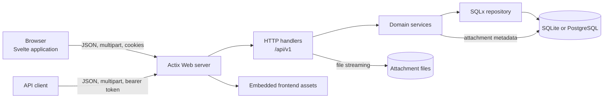

# Architecture

This document describes how Racebin is structured, how its major components
interact, and where new behavior belongs. It reflects the current
implementation rather than a future design.

## Design goals

Racebin is designed as a small, self-hosted application with a simple
operational footprint. The architecture favors:

- one deployable server binary;
- a stable HTTP API shared by the browser application and other clients;
- SQLite for small installations and PostgreSQL for installations that need
  it;
- explicit authorization and transactional invariants in the backend;
- a frontend that can provide an application-like editing experience without
  requiring a separate JavaScript server; and
- portable, inspectable storage rather than mandatory external services.

The application is intentionally not divided into independently deployed
services. Its internal layers provide separation of concerns while remaining
part of one process.

## System overview



The browser application never accesses storage directly. It uses the same
`/api/v1` endpoints exposed to external API clients. Actix serves that API,
the compiled frontend, attachment data, archives, and optional QR codes.

## Runtime composition

`src/main.rs` is the composition root. At startup it:

1. Dispatches a requested database or account CLI command, if present.
2. Validates server configuration.
3. Creates the data directory.
4. Opens the configured database and selects its backend.
5. Applies the matching SQLx migrations.
6. Purges expired records and orphaned attachment directories.
7. Starts an hourly expiration-cleanup task.
8. Constructs one shared `PasteService`.
9. Starts the Actix HTTP server with the configured worker count.

Actix owns the asynchronous runtime. The service and repository are cheap,
cloneable handles shared with each worker; SQLx owns the underlying connection
pool.

The server applies request logging, trailing-slash normalization, JSON and
query parsing limits, and common security headers at the application
boundary.

## Backend layers

The Rust backend is divided by responsibility:

| Layer | Location | Responsibility |
| --- | --- | --- |
| Process and configuration | `src/main.rs`, `src/args.rs` | Startup, environment and CLI configuration, server construction, periodic cleanup |
| HTTP transport | `src/http/` | Routing, request parsing, authentication extraction, status codes, cookies, uploads, downloads, and response serialization |
| Domain services | `src/services/` | Paste rules, visibility, ownership, validation, conversion, read limits, search, and transactional operations |
| Accounts and credentials | `src/account/` | Users, passwords, sessions, invitations, API keys, and scopes |
| Persistence | `src/repository.rs`, `src/repository/` | Backend selection, connection pooling, migrations, database copy, and shared storage primitives |
| Operator CLI | `src/cli/` | Account administration, database copy, and OpenAPI export commands |

HTTP handlers should remain transport adapters. Rules that must also hold for
future transports or CLI callers belong in a service or account operation,
not solely in a handler. Database-specific setup and migration selection
belong in the repository layer.

`PasteService` is currently the main application service. It owns a
`Repository` and accepts a `Principal` representing an anonymous request,
browser session, or API key. This keeps authorization decisions close to the
operations they protect.

### Error boundaries

Domain services and account operations return `DomainResult<T>`. A
`DomainError` retains its category, stable API code, and safe client-facing
message until the HTTP layer converts it to a problem-details response.
Transport handlers must use the common `domain_error` conversion rather than
reconstructing a status or code from an error string.

Raw string errors are limited to boundaries where they are the natural local
representation, including request parsing, rich-text parsing, operator CLI
commands, and repository startup or copy operations. Callers classify those
errors explicitly when they enter the domain layer. There is deliberately no
implicit `String` to `DomainError` conversion, so accidentally discarding a
typed error is a compile-time failure.

## HTTP and API design

The supported resource API lives below `/api/v1`. Conventional liveness and
readiness probes are also exposed as `/healthz` and `/readyz`. API routes are
grouped by resource:

- metadata and runtime configuration;
- sessions and accounts;
- pastes and rich-text conversion;
- attachments, archives, and QR output;
- user-owned API keys; and
- administrative users, invitations, API keys, and paste management.

The API uses JSON for ordinary requests and responses, accepts raw text and
forms for generic uploader compatibility, and uses multipart bodies for atomic
paste-and-file creation. Errors use RFC 9457-style problem details. The
Rust-generated OpenAPI 3.1 contract is exposed at `/api/v1/openapi.json`; a
normalized copy is committed at `openapi/openapi.json` for review and client
generation.

Unknown API routes return JSON errors. Known browser routes receive the SPA
entry document, while unknown non-API paths return a 404. This explicit
allowlist prevents the SPA fallback from disguising arbitrary missing paths.
Those browser routes are an implementation detail of the bundled client rather
than part of the public HTTP API contract.

See [api.md](api.md) for the endpoint contract.

## Authentication and authorization

Racebin supports two authentication mechanisms:

- Browser sessions use an HTTP-only `racebin_session` cookie. The stored
  session contains a separate CSRF token that the frontend sends in the
  `X-CSRF-Token` header for mutations.
- API clients use bearer tokens. Each API key has an explicit set of scopes,
  and bearer-authenticated requests do not use browser CSRF protection.

Racebin does not emit CORS headers and assumes its browser client is served from
the same origin. Cross-origin browser access, when deliberately required, is an
operator-owned reverse-proxy policy. Session cookies are HTTP-only,
`SameSite=Lax`, scoped to `/`, and secure except in explicit insecure-cookie
development mode.

Passwords are hashed with Argon2id. Session, invitation, and API-key secrets
are random values, and their hashes are used for authentication. Session and
API-key plaintext secrets are never retained. Active invitations additionally
retain their token so an administrator can copy the URL again; the token is
cleared when the invitation is redeemed or revoked.

Authorization is enforced by both the HTTP and domain layers:

- transport helpers require authentication, CSRF validation, or an
  administrative scope;
- service validation enforces visibility and ownership;
- API-key scopes constrain individual operations; and
- transactional account operations prevent disabling or demoting the last
  enabled administrator.

Disabled users cannot authenticate, and disabling an account or changing its
password revokes its sessions. A forced password change limits the session to
the session and password endpoints until the password is replaced.

## Data model

The main relational entities are:

| Entity | Purpose and relationships |
| --- | --- |
| `users` | Account identity, password hash, role, enabled state, forced-password-change state, and last login |
| `sessions` | Expiring browser credentials owned by users; deleted with their user |
| `password_reset_tokens` | One-time, one-hour password recovery hashes created by administrators |
| `invitations` | Expiring, revocable account invitations with creator and redeemer attribution |
| `api_keys` | Hashed bearer credentials, optionally owned by a user |
| `api_key_scopes` | Many-to-one scope assignments deleted with their API key |
| `pastes` | Text or rich-text content, owner, visibility, expiration, revision, and read-limit state |
| `folders` | Private, flat organizational containers owned by users |
| `attachments` | Ordered attachment metadata owned by a paste |
| `idempotency_records` | Expiring create-request results used to make retries safe |
| `paste_read_receipts` | Expiring replay records for idempotent read requests |
| `paste_read_grants` | Short-lived capabilities for final-read attachment downloads |
| `auth_attempts` | Expiring authentication-failure records used for rate limiting |

Rich text is stored as a validated JSON document alongside a plain-text
representation. The frontend uses Tiptap's ProseMirror model internally, but
the public API accepts and returns sanitized HTML. This keeps an editor-specific
document schema out of the public contract.

Foreign keys implement ownership cleanup where possible. A deleted user
leaves their pastes intact with a null owner, while their sessions and
user-owned API keys are removed. Deleting a paste removes its attachment
metadata.

Each owned paste may reference one folder. Folder identity is private to its
owner and does not affect paste visibility or URLs. Deleting a folder clears
the assignment rather than deleting its pastes.

## Database abstraction

SQLx's `Any` driver provides the common query interface for SQLite and
PostgreSQL. `Repository::open` identifies the backend from the URL and
configures its pool:

- SQLite uses foreign-key enforcement, WAL mode, and a busy timeout.
- PostgreSQL uses its normal transactional and row-locking behavior.

Each backend has a parallel migration directory under `migrations/`. The
migration sets represent the same logical schema while allowing backend
syntax and identity behavior to differ.

Operations with concurrency-sensitive invariants use transactions. The
repository also provides a process-local write lock to serialize critical
write sequences consistently, while PostgreSQL operations use row locks where
appropriate. Examples include consuming a read-limited paste, redeeming an
invitation, preserving the last administrator, and assigning attachment
ordering.

The database-copy command migrates an empty destination, copies all
application rows transactionally, verifies attachment references and row
counts, and resets PostgreSQL identity sequences before committing.

See [database.md](database.md) for backend selection, backups, and migration.

## Attachment storage

Attachment metadata lives in the database, but bytes live below:

```text
<data-dir>/attachments/<paste-id>/<storage-key>
```

User-provided filenames are display metadata and are not used as filesystem
paths. Storage keys are generated identifiers, and path construction rejects
unsafe components.

Uploads are streamed into temporary files while enforcing per-request limits.
After all fields are valid, files are renamed to their final storage keys and
their metadata is inserted. Cleanup guards remove staged or promoted files
when a later step fails. Downloads re-check paste visibility and ownership
before opening a file.

The database and attachment directory therefore form one logical data set.
Backups must include both. PostgreSQL does not make attachment storage
external or replicated automatically.

## Frontend architecture

The browser interface is a Svelte 5 single-page application in `web/src`.
TypeScript is used for application code and component scripts.

Racebin does not use SvelteKit. It has a deliberately application-specific
navigation runtime under `web/src/navigation`. The implementation is divided
by responsibility:

- `routes.ts` defines route parsing and page titles;
- `guards.ts` owns the active form's unsaved-change guard and the common
  discard prompt used by links, back/forward navigation, logout, and browser
  unloads;
- `scroll.ts` owns Racebin's namespaced History API state and scroll
  positions; and
- `runtime.ts` executes navigation transactions, access-policy redirects,
  page readiness, history updates, title updates, focus, and scroll
  restoration in a fixed order.

A navigation is resolved before it is published. Authentication,
administrator access, and forced-password-change redirects therefore happen
before a protected page can mount. Once the destination is published, a page
may call `holdNavigation()` while its initial data or lazy component loads.
The transaction restores scroll and completes only after all holds are
released and Svelte has rendered. Holds and asynchronous policy decisions are
transaction-scoped, so stale work cannot complete or overwrite a newer
navigation.

Each browser history entry carries its own navigation index and scroll
position without replacing unrelated `history.state` fields. Internal
push/replace navigation starts at the top and moves focus to the page heading;
back/forward navigation restores the saved position without stealing focus.

`App.svelte` is the frontend composition root. It loads the current session,
provides the route access policy, and chooses the page component.
`Shell.svelte` owns the shared navigation and page frame. Pages compose
reusable controls from `web/src/components`.

Application-wide session and configuration state lives in a small Svelte
store. The browser API boundary is divided into generated wire types,
normalization, named resource operations, and one private transport under
`web/src/api`. The transport alone performs network requests and owns JSON and
multipart serialization, CSRF, conditional and idempotency headers, protocol
response headers, problem-details errors, and query invalidation. Pages call
named operations and do not construct API paths or wire requests.

The committed, normalized OpenAPI snapshot is generated from the Rust routing
contract, and the TypeScript wire types are generated from that snapshot. CI
regenerates both artifacts, rejects stale output, and rejects direct frontend
network access outside the transport. This makes an API change a coordinated
change to the runtime, contract, generated types, resource client, and tests.

The query cache is kept separate from navigation: it deduplicates and retains
resource reads, invalidates them after mutations, and lets list pages render
cached data while revalidating. Page request generations prevent an older
response from replacing a newer query, while navigation readiness determines
only when the new page is structurally ready for focus and scroll restoration.

Notable browser-side technologies are:

- **Tiptap/ProseMirror** for structured rich-text editing;
- **Highlight.js** for syntax highlighting and language detection;
- **Inter 4.1** as a bundled variable font for consistent layout across hosts;
- **Vite** for bundling and code splitting;
- **Vitest** with jsdom for unit and component tests; and
- **Playwright** for browser-level workflows.

Large optional features, including rich-text components and uncommon syntax
grammars, are loaded as separate JavaScript chunks. There is still one
application deployment: chunking reduces initial browser work rather than
creating separately deployed frontend services.

### Styling system

`web/src/style.css` is the stylesheet manifest. It imports the styling layers
in a deliberate order:

1. `web/src/styles/tokens.css` defines semantic colors, spacing, control
   geometry, radii, page dimensions, sticky offsets, and stacking levels.
2. `web/src/styles/base.css` supplies the reset, typography, document frame,
   and accessibility utilities.
3. `web/src/styles/primitives.css` defines reusable layout and interaction
   primitives such as stacks, clusters, headings, and buttons.
4. `web/src/styles/layout.css` defines the shared shell and page compositions.
5. `web/src/styles/rich-text.css`, `folder-responsive.css`, and
   `paste-library.css` contain focused feature styling.
6. `web/src/styles/responsive.css` applies the final cross-feature responsive
   adaptations.

New UI should use semantic tokens and existing primitives before adding a
component-specific rule. Components own their internal layout; pages own only
the arrangement between components. Fixed dimensions and sticky offsets must
come from tokens when they participate in shared alignment. This keeps layout
behavior consistent and prevents page-specific overrides from becoming a
second design system.

## Frontend build and embedding

The production build has two stages:

1. Vite compiles the Svelte application into `web/dist`.
2. Cargo builds the server after the frontend exists.

`build.rs` enumerates every file below `web/dist/assets`, determines its
content type, and generates Rust source containing `include_bytes!` entries.
The SPA entry document is included directly by `src/http/assets.rs`. The
resulting executable contains the HTML, CSS, JavaScript, and lazy-loaded
chunks needed by the browser.

This provides a single deployable binary and prevents runtime asset-version
mismatches. The tradeoff is that every frontend change requires rebuilding
the Rust binary. Development still uses Vite's local server and mocked API
responses for fast browser tests.

## Content flow

A typical paste creation follows this path:

1. A Svelte form collects text or sanitized rich-text HTML and optional files.
2. The frontend sends one JSON or multipart request to `/api/v1/pastes`.
3. The HTTP handler resolves the principal and validates CSRF or API-key
   authentication.
4. `PasteService` validates content, visibility, language, expiration, read
   limits, ownership, and rich-text structure.
5. The multipart parser streams files to staging while calculating their
   digests and enforcing configured size, field, and attachment-count limits.
6. SQLx records the paste, revision, idempotency result, and attachment metadata.
7. The browser navigates to the paste view and reads it through the same
   API available to other clients.

`GET /api/v1/pastes/{id}` is metadata-only.
`POST /api/v1/pastes/{id}/reads` atomically updates the read count. A final read
tombstones the paste instead of immediately deleting its row and issues a
15-minute capability for its files; cleanup later removes the tombstone and
storage. Owner and administrator source reads do not consume the paste.
Revisions and ETags protect update and delete operations from lost updates.

## Background work and cleanup

Racebin performs a cleanup pass at startup and then hourly. It:

- deletes expired pastes;
- deletes consumed paste tombstones after the attachment-grant window;
- deletes expired idempotency records, read receipts, and attachment grants;
- deletes expired sessions and password-reset tokens;
- deletes stale authentication-attempt records;
- removes old expired invitations;
- removes stale upload-staging files; and
- removes attachment directories belonging to deleted or unknown pastes.

This is an in-process task rather than a separate worker service. If Racebin
is stopped, cleanup resumes at the next startup.

## Deployment model

The normal production topology is:

```text
HTTPS reverse proxy
        |
Racebin system service
        |
        +-- SQLite file or PostgreSQL server
        |
        +-- local attachment data directory
```

The reverse proxy terminates TLS and forwards requests without rewriting paths.
Racebin remains a single service even when it uses PostgreSQL; attachments
continue to live in the configured data directory.

The repository includes a systemd unit and example environment file under
`packaging/`, plus an Arch `PKGBUILD`. They are packaging examples rather
than requirements of the runtime architecture.

Running multiple Racebin replicas would require shared attachment storage and
careful review of operations that currently rely on a process-local write
lock. The supported simple deployment is one Racebin process with multiple
Actix workers.

See the [setup guide](setup.md) for build and installation instructions,
configuration, systemd, Nginx and Caddy examples, trusted-proxy behavior, TLS,
upgrades, and troubleshooting.

## Testing strategy

Tests are organized around architectural boundaries:

- repository unit tests cover storage helpers and query behavior;
- a shared backend contract runs against SQLite and PostgreSQL;
- concurrency tests exercise read limits, invitations, one-time password
  resets, administrator invariants, and attachment ordering;
- migration tests verify startup and schema behavior;
- copy tests cover complete transfers, validation, rollback, and PostgreSQL
  sequence continuation;
- HTTP integration tests cover sessions, CSRF, API-key scopes, visibility,
  ownership, administration, and files;
- Vitest covers frontend routing, formatting, and components; and
- Playwright covers critical browser workflows with deterministic API
  fixtures and exercises authentication, CSRF, API-key scopes, idempotency,
  ETags, multipart uploads, and final-read grants through a disposable real
  server.

PostgreSQL tests require a dedicated disposable database and reset its
`public` schema. See [testing.md](testing.md) for commands and safety details.

## Repository map

```text
src/
  account/              account, session, invitation, and API-key logic
  cli/                  operator commands
  http/                 Actix routes and transport concerns
  integration_tests/    backend, concurrency, migration, copy, and HTTP suites
  repository/           database-copy implementation and repository tests
  services/             paste domain model, validation, conversion, and service
web/
  src/api/              generated wire types, transport, normalization, and named resources
  src/components/       reusable Svelte controls
  src/navigation/       routes, guards, history/scroll, and navigation runtime
  src/pages/            route-level Svelte components
  e2e/                  Playwright browser workflows
  dist/                 compiled frontend embedded by Cargo
openapi/                normalized generated API contract
migrations/
  sqlite/               SQLite schema history
  postgres/             PostgreSQL schema history
docs/                   operator, API, testing, and architecture guides
packaging/               service configuration and package recipes
scripts/                 reproducibility, naming, and architecture checks
```

## Adding or changing functionality

Use the existing boundaries when extending Racebin:

- Add or change an API contract in `src/http`, but place reusable business
  rules in `src/services` or `src/account`.
- Keep SQLite and PostgreSQL migrations logically equivalent.
- Treat database rows and attachment files as a coordinated data set.
- Enforce authorization on the server even when the frontend hides a control.
- Add backend contract coverage for storage behavior shared by both
  databases.
- Add HTTP tests for authorization and error semantics.
- Update the OpenAPI contract and regenerate its snapshot and TypeScript wire
  types for every API change; frontend callers go through a named API resource.
- Add Playwright coverage when behavior depends on real browser layout,
  navigation, editing, or file interaction.
- Rebuild `web/dist` before compiling a production binary after frontend
  changes.
